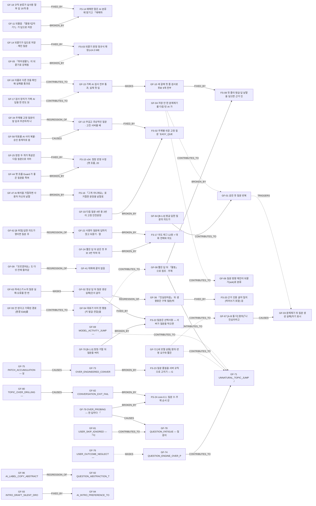

# Failure Graph (v1 · 2026-09-25)

> `docs/failure-intelligence/data/failure-graph.json` 에서 생성. 실선 = 근거 있음(ACTUAL·CODE), 점선 = HYPOTHESIS(인과 미확정).

| From | 관계 | To | 증거 | 설명 | 근거 |
|---|---|---|---|---|---|
| GF-10 | FIXED_BY | FS-08 | ACTUAL | v15.2 가 GF-10 대책으로 운영 배포됨 | `docs/claude-final-review-20260916/PATCH-20260924-level3-fix/LEVEL3_실제실패_수정_v15.2_20260924.md` |
| GF-08 | BROKEN_BY | FS-08 | ACTUAL | FAIL #2 분석: 받아 주는 첫 줄만 있으면 이어졌다고 인정해 「활동」 점프 통과 | `docs/claude-final-review-20260916/PATCH-20260924-level3-fail2/LEVEL3_FAIL2_구조원인분석_20260924.md` |
| GF-18 | FIXED_BY | FS-14 | ACTUAL | v15.1 규칙 축소 + 애매하면 AI(실패 시 답) | `CLAUDE.md` |
| GF-11 | BROKEN_BY | FS-14 | ACTUAL | FAIL #2: AI 분류 「애매하면 answer」 → 되물음 저장 | `docs/claude-final-review-20260916/PATCH-20260924-level3-fail2/LEVEL3_FAIL2_구조원인분석_20260924.md` |
| GF-14 | FIXED_BY | FS-03 | CODE | v27 ruleKind 가 「딥하네」·「활동?질문이 머이래」 를 meta 로 잡음(Replay R1) | `docs/failure-intelligence/REPLAY_결과_20260925.md` |
| GF-05 | BROKEN_BY | FS-03 | HYPOTHESIS | 짧은 물음표 규칙이 원인인 것은 코드 확인 · 그 규칙이 v14.3 확장 때 들어왔는지는 미확인 | `docs/claude-final-review-20260916/PATCH-20260924-level3-fail3/LEVEL3_FAIL3_ROOT_CAUSE_20260924.md` |
| GF-13 | FIXED_BY | FS-02 | ACTUAL | v14.3 쉬운 고정 질문 도입 | `CLAUDE.md` |
| GF-04 | CONTRIBUTES_TO | GF-01 | HYPOTHESIS | 항의가 다음 턴 입력에 없어 같은 뜻을 되풀이했을 수 있음(모델 분리 안 됨) | `docs/claude-final-review-20260916/PATCH-20260925-ab-spike/CTO_AB_SPIKE_보고_20260925.md` |
| GF-04 | CONTRIBUTES_TO | GF-06 | HYPOTHESIS | 앞선 「취미생활?」 이 입력에 없음 | `docs/claude-final-review-20260916/PATCH-20260924-level3-fail3/LEVEL3_FAIL3_ROOT_CAUSE_20260924.md` |
| GF-01 | TRIGGERS | GF-03 | HYPOTHESIS | 같은 세션에서 반복 질문 → 항의 → 항의 턴 실패 순서로 관측(인과는 미확정) | `docs/claude-final-review-20260916/PATCH-20260925-ab-spike/CTO_AB_SPIKE_보고_20260925.md` |
| GF-15 | MASKS | GF-10 | ACTUAL | 가짜 AI 479개 중 474 통과 뒤 배포, 첫 실제 입력 실패 | `docs/claude-final-review-20260916/PATCH-20260924-level3-fix/LEVEL3_실제실패_수정_v15.2_20260924.md` |
| GF-16 | CONTRIBUTES_TO | GF-15 | HYPOTHESIS | 같은 평가 결함 계열(통과 수가 실제 품질을 과대표시) | `docs/claude-final-review-20260916/PATCH-20260924-ai-conversation-v15/ECHO_MASTER_CODE_최종대조_v15_20260924.md` |
| GF-17 | CONTRIBUTES_TO | GF-15 | HYPOTHESIS | 같은 평가 결함 계열 | `CLAUDE.md` |
| GF-25 | FIXED_BY | FS-15 | ACTUAL | v34 정정 수정 | `docs/claude-final-review-20260916/FINAL_LOCK_REPORT_20260918.md` |
| GF-44 | BROKEN_BY | FS-15 | ACTUAL | 막다른 길 2→5 악화(보고서 자인) | `docs/claude-final-review-20260916/FINAL_LOCK_REPORT_20260918.md` |
| GF-47 | BROKEN_BY | FS-16 | CODE | 거절 문장을 낱말로 쪼개 금지(31a9091 설명) | `git:31a9091` |
| GF-22 | BROKEN_BY | FS-17 | CODE | 의도 태그 소진 → 전 후보 repeat_intent | `docs/claude-final-review-20260916/COMPANION_FIX_REPORT_20260916.md` |
| GF-24 | BROKEN_BY | FS-17 | CODE | 전체 비교 → 3번 막힘 | `docs/claude-final-review-20260916/FIELD_DEFECTS_20260917.md` |
| GF-36 | FIXED_BY | FS-20 | ACTUAL | v13.6 띄어쓰기 무시 | `docs/claude-final-review-20260916/PATCH-20260921-v13-first-conversation/docs/ECHO_ASLEEP_CONVERSATION_FINAL_REPORT_20260922.md` |
| GF-02 | REGRESSION_OF | GF-36 | CODE | 같은 모양(글자 인용 검사로 정상 후보 탈락)이 v16 clue 로 재등장 | `docs/claude-final-review-20260916/PATCH-20260925-ab-spike/CTO_AB_SPIKE_보고_20260925.md` |
| GF-09 | REGRESSION_OF | GF-41 | CODE | 「다섯 답 = 끝」(GF-41 대책)이 「모르겠어요」도 세는 계약 불일치를 남김 | `CLAUDE.md` |
| GF-34 | REGRESSION_OF | GF-13 | ACTUAL | 무거운 질문 대책(쉬운 고정 질문 FS-02)이 앞뒤 안 맞는 고정 질문을 낳음 | `CLAUDE.md` |
| GF-33 | BROKEN_BY | FS-02 | CODE | 고정 안전문장 구제 | `docs/claude-final-review-20260916/PATCH-20260924-homepage-final/prod/doit-understanding.v27.prod.ts` |
| GF-58 | CAUSES | GF-13 | ACTUAL | 「승인 주세요」로 턴 종료 → 고친 v14 미배포 → 대표가 옛 문장을 다시 봄(CLAUDE.md 자기 기록) | `CLAUDE.md` |
| GF-55 | CONTRIBUTES_TO | GF-54 | HYPOTHESIS | 막힌 경로를 다시 안내하면서 새 키 요구가 함께 나감 | `docs/failure-intelligence/evidence/ADVISOR_SESSION_20260925.md` |
| GF-62 | REGRESSION_OF | GF-22 | HYPOTHESIS | B 의도 장부가 옛 흐름 의도 태그 소진(FS-17)과 같은 모양 — 실AI 전 미확인 | `docs/failure-intelligence/FAILED_SOLUTIONS_ARCHIVE.md` |
| GF-63 | MASKS | GF-02 | CODE | 하네스가 A 질문 실패를 기록하지 못해 run1 표에서 GF-02 재현이 0 으로 보였다 | `docs/failure-intelligence/REAL_AB_RUN1_분석_20260925.md` |
| GF-64 | CONTRIBUTES_TO | GF-01 | ACTUAL | [REAL run1] B 가 방금 답한 질문을 같은 턴에 다시 냄 | `docs/failure-intelligence/REAL_AB_RUN1_분석_20260925.md` |
| GF-67 | CAUSES | GF-03 | ACTUAL | [REAL run1] 항의 저장으로 대화가 끝나 뒤의 항의가 AI 에 가지 않음 | `docs/failure-intelligence/REAL_AB_RUN1_분석_20260925.md` |
| GF-69 | CONTRIBUTES_TO | GF-08 | HYPOTHESIS | [REAL run1] 주제 입력이 없는 B 에서도 같은 「활동」 점프 → 모델 몫 가설 | `docs/failure-intelligence/REAL_AB_RUN1_분석_20260925.md` |
| GF-02 | FIXED_BY | FS-22 | CODE | B-1.0 은 막힌 질문을 버리고 반응만 보내 실패 안내를 없앰 | `docs/failure-intelligence/evidence/REAL_AB_RUN1_20260925/P0_BLIND_RESULT_RUN1.md` |
| GF-70 | BROKEN_BY | FS-22 | ACTUAL | 대표 블라인드: 질문 없이 멈춘 B 보다 A 선택(P09·P10) | `docs/failure-intelligence/evidence/REAL_AB_RUN1_20260925/P0_BLIND_RESULT_RUN1.md` |
| GF-69 | CONTRIBUTES_TO | GF-71 | HYPOTHESIS | 같은 모델에서 두 구조 모두 점프 → 모델 몫 가설 | `docs/failure-intelligence/evidence/REAL_AB_RUN1_20260925/P0_BLIND_RESULT_RUN1.md` |
| GF-08 | CONTRIBUTES_TO | GF-71 | ACTUAL | 운영 v26 실제 점프 사례(대표 「활동?갑자기?」) | `docs/failure-intelligence/evidence/REAL_AB_RUN1_20260925/FOUNDER_FEEDBACK_20260925.md` |
| GF-72 | CONTRIBUTES_TO | GF-67 | HYPOTHESIS | 항의에 대한 대응 계약이 없어 네 모델 모두 실패 — 저장 문제와 같은 뿌리 가설 | `docs/failure-intelligence/evidence/MODEL_GATE_20260925/MODEL_BLIND_RESULT.md` |
| GF-72 | CONTRIBUTES_TO | GF-71 | HYPOTHESIS | 「활동」 뒤 항의(M11)를 네 모델 모두 반응만으로 끝냄 | `docs/failure-intelligence/evidence/MODEL_GATE_20260925/MODEL_BLIND_RESULT.md` |
| GF-75 | CAUSES | GF-73 | ACTUAL | 규칙이 쌓여 질문 하나에 LLM 최대 9회 · 정상 후보 소실 | `docs/claude-final-review-20260916/PATCH-20260924-level3-fail2/LEVEL3_FAIL2_구조원인분석_20260924.md` |
| GF-74 | CONTRIBUTES_TO | GF-71 | ACTUAL | 주제 칸이 사용자가 꺼내지 않은 방향을 줌 | `docs/claude-final-review-20260916/PATCH-20260924-level3-fail2/LEVEL3_FAIL2_구조원인분석_20260924.md` |
| GF-73 | BROKEN_BY | FS-23 | ACTUAL | 질문 심사 규칙 누적 | `docs/failure-intelligence/CONVERSATION_CONTRACT_20260925.md` |
| GF-76 | MASKS | GF-74 | HYPOTHESIS | 기계 지표가 목적 불일치를 가림 | `docs/failure-intelligence/evidence/MODEL_GATE_20260925/MODEL_BLIND_RESULT.md` |
| GF-82 | BROKEN_BY | FS-24 | ACTUAL | 끝 조건을 영역 배정에 맡김 | `docs/failure-intelligence/evidence/FOUNDER_PHONE_TEST_20260925/README.md` |
| GF-79 | BROKEN_BY | FS-24 | ACTUAL | 방금 말 붙잡기가 과잉 탐문으로 | `docs/failure-intelligence/evidence/FOUNDER_PHONE_TEST_20260925/README.md` |
| GF-79 | CAUSES | GF-78 | ACTUAL | 꼬리질문 연속 → 피로 | `docs/failure-intelligence/evidence/FOUNDER_PHONE_TEST_20260925/README.md` |
| GF-80 | CAUSES | GF-82 | ACTUAL | 비는 영역 → 끝 조건 미충족 | `docs/failure-intelligence/evidence/FOUNDER_PHONE_TEST_20260925/README.md` |
| GF-81 | CONTRIBUTES_TO | GF-78 | ACTUAL | 넘기기 무시 → 피로 | `docs/failure-intelligence/evidence/FOUNDER_PHONE_TEST_20260925/README.md` |
| GF-96 | REGRESSION_OF | GF-92 | ACTUAL | 구체 질문 지침 뒤에도 AI 용 이름의 추상명사가 질문으로 새어 나옴 | `docs/claude-final-review-20260916/PATCH-20260925-master-ux/REAL_AI_RUN13_result.md` |
| GF-93 | FIXED_BY | GF-94 | ACTUAL | 근거 검사를 넓혀 초안을 살리자 뜻 왜곡(글자 검사로 못 가림)이 드러남 | `docs/claude-final-review-20260916/PATCH-20260925-master-ux/REAL_AI_RUN14_result.md` |

- 관계 47개 중 HYPOTHESIS 13개. HYPOTHESIS 는 원인 판정에 쓰지 않는다.
- 되풀이된 모양: 실패 → 대책(규칙·검사·기본값) → 반대 방향 실패(BROKEN_BY). GF-10→FS-08→GF-08, GF-18→FS-14→GF-11, GF-14→FS-03→GF-05(도입 시점 미확인).
